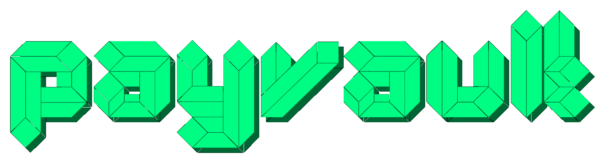

<p align="center"></p>

# PayVault — Confidential Payroll on Nox

> Pay your team on-chain without ever revealing salaries, while staying fully auditable.
> Built for the iExec WTF Hackathon (Summer Edition) on Nox, iExec's confidential smart-contract layer.

**Live demo:** https://payvault.shadrakbessanh.me
**Network:** Ethereum Sepolia (chainId 11155111)

---

## The problem

Public blockchains expose everything. If a company pays its team on-chain, the whole world can read who earns how much. That is a non-starter for real businesses. But if you hide everything, how does an auditor or a tax authority verify compliance?

## The solution

PayVault layers confidentiality over an existing public protocol (Sablier) using Nox, without modifying it and without breaking composability:

1. **Public funding (Sablier).** The company funds the vault with one public Sablier stream. The public sees only the aggregate budget. The vault then pulls the vested funds from the stream (`pullFunding`), so the money genuinely flows through Sablier into the vault.
2. **Confidential payroll.** Each salary is encrypted (`euint256` handle). It is never visible on-chain; only the company and the employee can decrypt it. An encrypted running total is kept in sync.
3. **Selective disclosure.** The company grants an auditor read access to the aggregate total only. The auditor decrypts the total but cannot read any individual salary.
4. **Confidential payout (ERC-7984).** `runPayroll()` mints each employee a confidential cPAY balance equal to their encrypted salary. Amounts stay hidden on-chain.
5. **Withdrawal.** An employee unwraps their cPAY back into real public PayUSD through a public-decryption proof. The amount is revealed only when the employee chooses to cash out.

```
Company (MetaMask)
   |  creates a public Sablier stream (budget visible)
   v
Sablier Lockup (public, unmodified)
   |  vault.pullFunding() withdraws the vested funds
   v
PayrollVault (Nox confidential contract, ERC-7984 "cPAY")
   |  salaries = euint256 (encrypted); running total = euint256
   |  ACL: company + employee can read a salary
   |  ACL: auditor can read ONLY the total   <- selective disclosure
   v
Employee unwraps cPAY -> real PayUSD (public-decryption proof)
```

## Roles

| Role | URL | What it does |
|---|---|---|
| Company | `/app` | Fund payroll, add employees with encrypted salaries, run confidential payout, manage auditors. |
| Auditor | `/audit` | Decrypt the aggregate total a company granted, never an individual salary. |
| Employee | `/mypay` | Decrypt their own pay and withdraw it to real PayUSD. |

## Deployed contracts (Ethereum Sepolia)

| Contract | Address |
|---|---|
| PayrollVault (the cPAY ERC-7984 token) | `0xa775bf4d13d70984959a06ef4f61e0e68d56e0f5` |
| PayUSD (test payroll ERC-20) | `0x35e3be25997a21a34ff79a2562e13a9d1d06937f` |
| Sablier Lockup (external, unmodified) | `0xe61cb9153356419bdaD0A8767c059f92d221a3C4` |

Explorer: https://sepolia.etherscan.io/address/0xa775bf4d13d70984959a06ef4f61e0e68d56e0f5

## How Nox is used

- Encrypted type `euint256` for every salary and the running total.
- `Nox.fromExternal(handle, proof)` to accept SDK-encrypted inputs.
- `Nox.add` / `Nox.sub` to keep the encrypted total in sync.
- ACL (`Nox.allowThis`, `Nox.allow`) after every operation — the core of selective disclosure (the auditor is granted the total handle only).
- ERC-7984 confidential token via `@iexec-nox/nox-confidential-contracts`, with the ERC20-to-ERC7984 wrapper for confidential withdrawal (`unwrap` + on-chain public-decryption proof).
- JS SDK `@iexec-nox/handle`: `encryptInput`, `decrypt`, `publicDecrypt` (gasless, EIP-712) in both the scripts and the browser.

## Repository layout

```
contracts/                Hardhat 3 + Nox confidential smart contracts
  contracts/
    PayrollVault.sol        multi-tenant confidential payroll, ERC-7984 cPAY, Sablier funding
    PayUSD.sol              test ERC-20 payroll currency
    ConfidentialPiggyBank.sol   Nox hello-world smoke test
  scripts/
    deploy.ts               deploy PayUSD + PayrollVault
    seed.ts                 end-to-end: fund via Sablier, pull, add employee, run payroll
frontend/                 Vite + React dashboard (Company / Auditor / Employee)
  src/
    App.tsx                 routing, company dashboard, auditor and employee pages
    Landing.tsx             public landing (before/after on-chain proof)
    lib/                    contract addresses, ABIs, wagmi config, Nox handle client
serve.py                  static SPA server (served behind a Cloudflare tunnel)
```

## Getting started — contracts

```bash
cd contracts
npm install
cp .env.example .env          # set SEPOLIA_RPC_URL and a funded test SEPOLIA_PRIVATE_KEY
npx hardhat build             # compile (solc 0.8.35, evm osaka)
npx hardhat run scripts/deploy.ts --network sepolia   # deploy PayUSD + PayrollVault
npx hardhat run scripts/seed.ts   --network sepolia   # fund via Sablier + run payroll
```

## Getting started — frontend

```bash
cd frontend
npm install
npm run dev        # local dev at http://localhost:5173
npm run build      # static build into dist/
```

Optional env: `VITE_RPC_URL` (Sepolia RPC), `VITE_LOGS_RPC_URL` (event queries), `VITE_WC_PROJECT_ID` (WalletConnect).

## Try the live demo

1. Open the app and connect as a company (Get started).
2. Fund payroll (routes the budget through a public Sablier stream), add an employee, run payroll.
3. Open `/mypay` as the employee: decrypt your pay, then withdraw it to real PayUSD.
4. Open `/audit` as an auditor: decrypt the company total, never an individual salary.

## License

MIT
